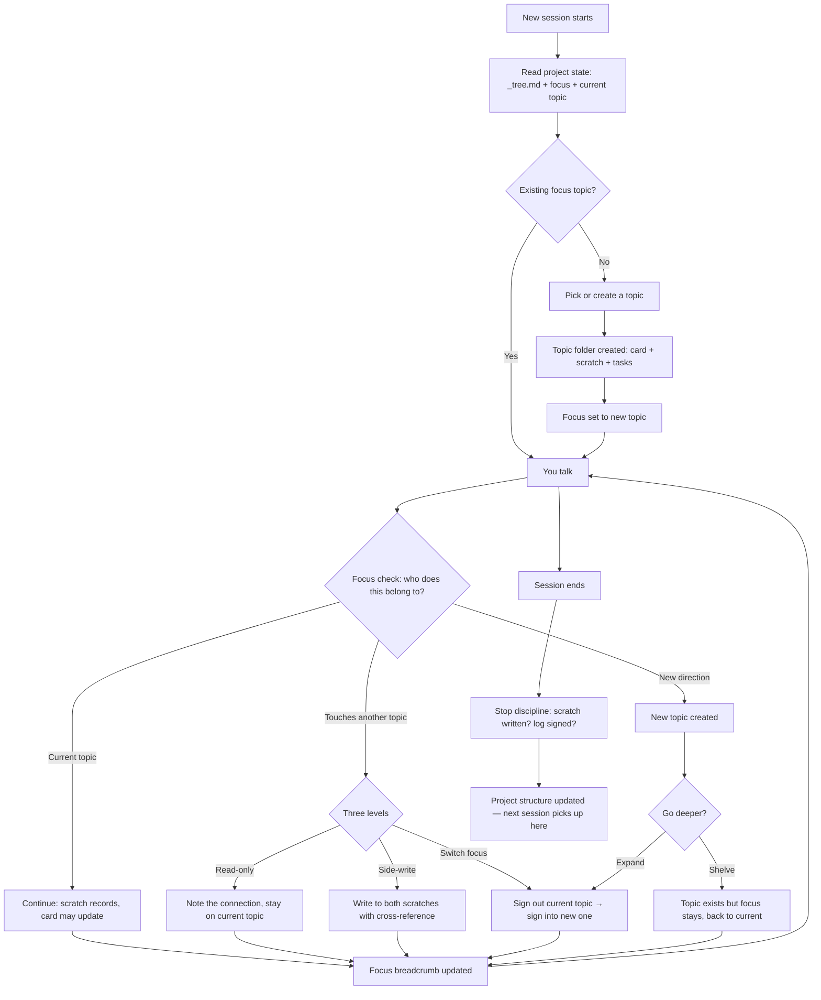

<div align="center">

# roamfound

**Roam Free. Stay Found.**

Continuous human-AI collaboration structured by topic — designed to follow your nature, not fight it.

[](LICENSE)
[]()
[]()
[]()
[]()


[中文](README.zh-CN.md)

</div>

---

## Why this exists

I use AI Agents to do real projects — research, writing, building things. Not one-off questions, but stuff that takes weeks or months. And there's this wall you keep hitting.

You spend two hours with Claude or GPT working through a problem. You reach some conclusions, figure out a direction. Session ends. Next day — gone. You try to explain where you left off, but you can't even remember everything you discussed yesterday.

So people build memory systems. AGENTS.md, Mem0, Letta, RAG, knowledge graphs — the ecosystem is huge now. The general idea: extract facts from your conversations, store them somewhere, retrieve the relevant ones next time.

They help a little. But a project is not a collection of facts.

A project is a dozen directions you explored. Some led somewhere, some didn't. Some conclusions got overturned later. Some ideas are still half-baked. The relationships between these things — what depends on what, what contradicts what, what's still open — that's the actual state of your project. No retrieval system captures that. It gives you the five most similar paragraphs and hopes for the best.

What I wanted: the AI walks into my project and actually knows what's going on. Not guessing from fragments — seeing the full picture. What we've discussed, what we've concluded, what's still stuck, what we tried and abandoned.

That's what this does.

---

## The core idea

Instead of extracting bits of conversation into a database, roamfound turns your project directory into a structure that any Agent can read and navigate.

The organizing unit is a **topic**. Every direction you explore gets its own folder — think of it as a card with multiple faces. Each topic folder contains:

- `scratch.md` — the distilled conversation record. Not a raw chat log (too noisy), not an AI summary (loses your voice). It preserves your key original words on a timeline — what you actually said, when you said it, with the noise filtered out. Think of it as a refined extract that keeps the flavor of the original.
- `card.md` — the conclusions. When you figure something out, it goes here. This is your single source of truth.
- `tasks.md` — what to do next. Derived from the discussion, not invented out of thin air.

These are plain markdown files in your project directory. When an Agent opens your project, it reads the topic tree and knows: here are the directions this project is exploring, here's what's been concluded, here's what's still open, here's where the human was focused last time.

No vector search. No embedding similarity. Just files that say what they mean.

---

## How it actually works day to day

You install roamfound, open your Agent, and start talking about whatever you're working on. You don't need to set anything up first. You don't need to "initialize" anything (though you can). You just talk.

As you discuss things, the system creates topics. You're talking about your research methodology? That's a topic. You suddenly realize you need to think about data sources? That's another topic. You go on a tangent about whether your theoretical framework even makes sense? That's a third one.

The key thing is: **you don't have to decide any of this in advance.** You just talk naturally, and the system figures out what belongs where.

Here's what happens under the hood each turn:

1. You say something.
2. The system checks: does this belong to the current topic, or is it about something else?
3. If it's the current topic — it records the discussion in scratch, and updates the card if you've reached a conclusion.
4. If it touches another topic — depending on how much, it either notes the connection (read-only), writes a bit into that topic's scratch (side-write), or switches focus entirely.
5. If it's a completely new direction — a new topic gets created.



When you end a session, the system checks that everything's been written down. It won't let you leave without recording what happened. Next time you come back — whether it's tomorrow, next week, or with a completely different Agent — the full state is right there in the file tree.

---

## What your project looks like after a few weeks

```
your-project/
├── AGENTS.md                ← canonical project entry — every Agent reads this first
├── topics/
│   ├── main-research-question/
│   │   ├── card.md          ← "we've concluded X, Y is still open"
│   │   ├── scratch.md       ← 15 sessions of discussion
│   │   └── tasks.md         ← "next: test hypothesis with Z data"
│   ├── methodology-debate/
│   │   ├── card.md          ← "decided on approach A, rejected B because..."
│   │   ├── scratch.md
│   │   └── tasks.md
│   ├── that-tangent-about-theory/
│   │   ├── card.md          ← still empty — we haven't concluded anything yet
│   │   ├── scratch.md       ← but the discussion is recorded
│   │   └── tasks.md
│   └── _tree.md             ← how all topics relate to each other
├── doc/
│   └── Framework/           ← highest-compression project control layer
│       ├── Vision/          ← what done looks like — goals, acceptance criteria
│       ├── Structure/       ← how it's organized — outlines, module map
│       ├── Style/           ← how it should read/feel — voice, formatting rules
│       └── Trace/           ← how we got here — decisions, pivots, progress
├── logs/
│   └── stream.md            ← session history: who signed in when, what happened
├── roles/                   ← expert roles you can load on demand
└── .jiacong/
    ├── project.json         ← project metadata (machine-readable)
    └── focus.json           ← which topic you're on right now
```

Everything is plain markdown. You can read it yourself, edit it by hand, search it with grep, version it with git. There's no database, no server, no account. It's just files.

---

## The thing about "following human nature"

Most project management tools — and most AI workflows — assume you know what you're doing before you start. Write a spec. Define your scope. Have a plan.

That's not how thinking works. Especially in research, writing, or any creative/intellectual work. You start with a vague direction. You explore. You get sidetracked. You realize your original question was wrong. You come back to something you abandoned three weeks ago because now it makes sense.

Traditional tools punish this. You go off-plan, and the tool doesn't know what to do with it. Your notes are scattered. Your AI conversations are lost. You feel guilty for not being more organized.

roamfound is built for how people actually think:

- You don't need to be clear before you begin. Clarity comes from exploration, not before it.
- Going on a tangent isn't a failure — it's a new topic. It has a place now.
- You can switch between directions without losing anything. The system tracks where you are.
- Conclusions emerge when they're ready, not when a template demands them.
- You can shelve something and come back to it months later. It'll still be there, with full context.

The system follows you. You don't follow the system.

---

## Install

Clone or download the repo, then run the installer from the project root:

```bash
python install.py --agent claude    # Claude Code
python install.py --agent codex     # OpenAI Codex
python install.py --agent gemini    # Google Gemini CLI
python install.py --agent hermes    # Hermes Agent
python install.py --agent all       # all supported Agents
```

You can preview first, install several targets at once, or remove everything cleanly:

```bash
python install.py --agent claude,codex   # install multiple targets
python install.py --agent all --dry-run  # show what would change
python install.py --list-agents          # list supported targets
python uninstall.py --agent all          # clean removal
```

Open your Agent in a project directory and start talking. roamfound installs the Agent-level entry files and hooks/plugins that let the Agent read and maintain the topic structure in that project.

---

## Supported Agents

Works with Claude Code, OpenAI Codex, Google Gemini CLI, and Hermes Agent. They all share the same project state — you can use Claude today and Codex tomorrow without losing anything.

| CLI | What gets installed |
|:---|:---|
| Claude Code | `~/.claude/CLAUDE.md` + lifecycle hooks |
| OpenAI Codex | `~/.codex/AGENTS.md` + skills + bootstrap hook |
| Google Gemini CLI | `~/.gemini/GEMINI.md` + skills |
| Hermes Agent | `~/.hermes/SOUL.md` + self-contained plugin |

---

## Features

**Topics** — Every direction you explore gets its own folder. Three layers: raw discussion (scratch), conclusions (card), and next steps (tasks). The AI judges each turn whether to continue the current topic, side-write to another, or switch focus.

**Framework** — A four-part control layer that sits above individual topics. When conclusions stabilize and become project-level knowledge, they graduate into Framework:

- **Vision** — what "done" looks like. Goals, acceptance criteria, the shape of the finished thing.
- **Structure** — how the project is organized. Outlines, module boundaries, object relationships.
- **Style** — how the output should read and feel. Voice, formatting rules, presentation standards.
- **Trace** — how you got here. Decision log, pivots, progress markers, what was tried and abandoned.

Topics are where thinking happens. Framework is where stable conclusions land so they can govern future work across all topics. The AI checks every turn whether something should graduate from topic-level scratch into project-level Framework.

**Focus tracking** — The system always knows which topic you're on. This persists across sessions. When you come back, it picks up where you left off.

**Topic tree** — All topics are connected in a tree (`_tree.md`). You can see how your project's directions relate to each other — what's a subtopic of what, what's a sibling, what's independent.

**Session discipline** — Before ending a session, the system checks: has the discussion been recorded? Has the log been signed? This sounds strict, but it's the thing that makes everything else work. Nothing gets lost.

**Log stream** — `logs/stream.md` is a timeline of everything that happened at the project level: which topic was opened, when focus switched, when a session started and ended. It's not the discussion itself (that's in scratch) — it's the meta-layer that lets you see the project's history at a glance. Topic lifecycle events live here: opened, paused, closed, reopened.

**Health check** — One command scans your project structure. Are all topics linked in the tree? Are there broken references? Is the root directory clean? Catches structural drift before it becomes a mess.

**Role library** — Expert roles (methodologist, framework analyst, writing editor, etc.) that can be loaded on demand. They bring specialized knowledge without cluttering your daily context.

**Background watcher** — Monitors file changes and triggers structure checks. Optional, but useful for catching inconsistencies in real time.

**Multi-CLI** — All supported Agents share one project state. Switch freely between them.

---

## Why this isn't a memory system (or a wiki, or RAG)

The "AI forgets everything" problem already has a lot of solutions. They fall into a few categories:

**Platform-native memory** — ChatGPT, Claude, Gemini all have built-in memory now. They extract facts and preferences from your conversations and inject them into future sessions. Coding agents have their own version: CLAUDE.md, AGENTS.md, auto memory — project-level instructions that persist across sessions.

**Dedicated memory frameworks** — Tools like Mem0, Letta, Zep, Cognee build a separate memory layer. Some use knowledge graphs, some use temporal tracking, some let the agent actively manage its own memory. The ecosystem is large and growing fast.

**Knowledge base approaches** — LLM Wiki, RAG pipelines, Obsidian/Notion integrations. They make your existing documents queryable so the AI can pull in relevant context.

All useful. roamfound is compatible with all of them — your Agent's built-in memory still works, you can run Mem0 or RAG alongside it. Nothing conflicts.

But they're solving different problems than roamfound is.

Memory systems answer: "what did we talk about before?" They store facts and retrieve them. Good for preferences, personal details, accumulated knowledge. But they don't know what your project looks like right now — which directions you're exploring, which conclusions are current vs. superseded, what depends on what, where you got stuck.

Knowledge bases answer: "what do we know about X?" They make the AI smarter about a domain. Good for reference material. But they don't track the state of your thinking — they're static until you manually update them.

roamfound answers: "where are we in this project?" It's not storing facts or retrieving documents. It's maintaining the live structure of an ongoing intellectual effort — what's been explored, what's been concluded, what's still open, what contradicts what, and where the human's attention is right now.

The difference: memory makes the AI remember you. Knowledge bases make the AI smarter. roamfound makes the project legible — to you, to the AI, to a different AI, to future-you who forgot what happened three weeks ago.

---

## How it's built

```
roamfound/
├── skills/
│   └── smarter-project/        # the core logic
│       ├── SKILL.md            # full execution spec — this is what the AI reads
│       ├── scripts/            # health_check, focus_breadcrumb, watcher, topic_new
│       ├── references/         # operation manuals for specific workflows
│       ├── roles-library/      # expert roles
│       └── templates/          # topic and project templates
├── protocol-fragments/         # protocol injection blocks (8 pieces)
├── hooks/                      # lifecycle hooks for each CLI
├── hermes-plugin/              # Hermes self-contained plugin
├── install.py                  # one-click installer
└── uninstall.py                # uninstaller
```

The key insight: **the documentation is the product.** `SKILL.md` isn't a user manual — it's the execution spec that the AI reads after installation. The AI reads it and knows how to manage your project. You never need to read it yourself (though you can — it's just markdown).

---

## Roadmap

**What's done:**

- Topic system (card / scratch / tasks)
- Focus tracking + topic tree
- Session discipline (stop checks)
- Health check
- Role library with on-demand loading
- Multi-CLI support (Claude Code / Codex / Gemini / Hermes)
- Hermes self-contained plugin architecture
- Framework layer (Vision / Structure / Style / Trace) with per-turn graduation check
- Unified project entry mechanism — `AGENTS.md` as canonical root, `.jiacong/` as metadata center
- Clean install / uninstall for all supported Agents

**What's next:**

- Experience cards — structured conclusions inside topics that carry cognitive state (is this conclusion current? superseded? contested? historical?)
- Memory review — a way to audit what you've concluded across topics, catch contradictions, mark things as outdated
- Cross-topic search — a GUI layer for searching across all topics and projects

**Further out:**

- Multi-agent collaboration — multiple Agents working on the same project, sharing experience cards, detecting conflicts
- Auto-decay — conclusions that haven't been revisited gradually get flagged for human review
- Principle extraction — automatically identifying recurring patterns across your experience cards and surfacing them as project-level design principles

---

## The name

"Roam Free. Stay Found." — you can wander, explore tangents, change direction, follow your curiosity, and the system keeps track so you don't have to.

Under the hood you'll see another name — jiacong-flow, the engine.

---

## Contributing

Contributions welcome. See [CONTRIBUTING.md](CONTRIBUTING.md).

Not sure where to start? Open an issue or look for ones tagged `good first issue`.

---

[MIT](LICENSE)
