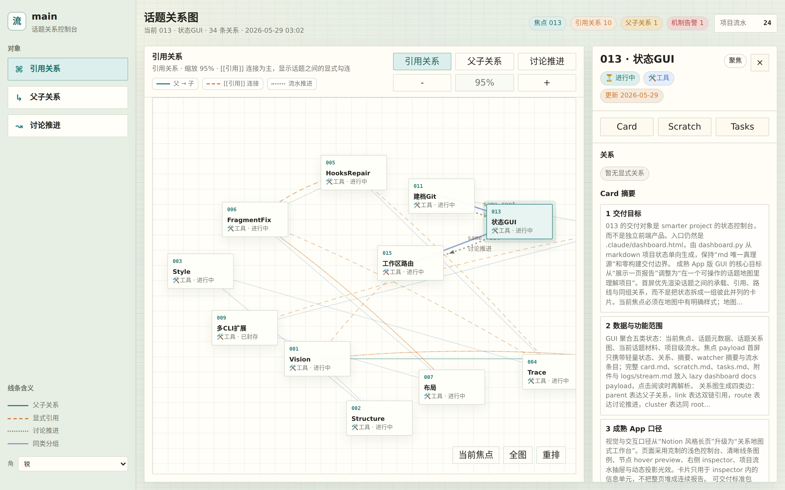
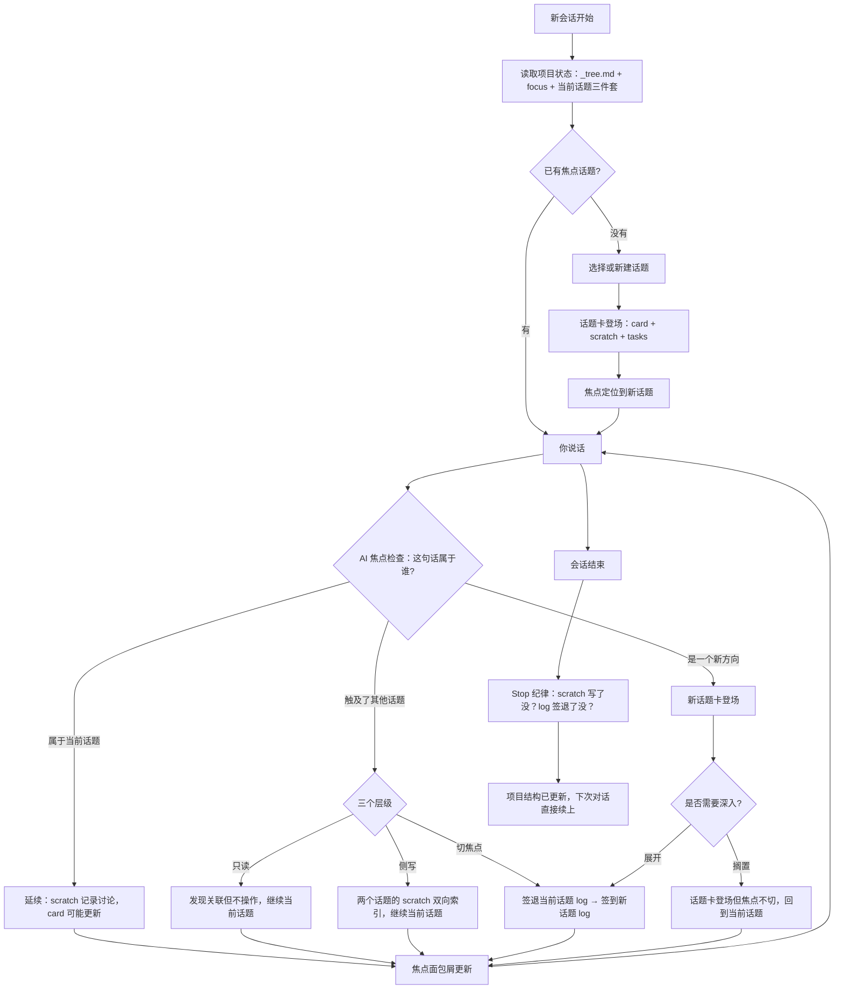

<div align="center">

# roamfound

**Roam Free. Stay Found.**

以话题为结构的持续人-AI 协作框架——服从你的天性，不跟它对着干。

[](LICENSE)
[]()
[]()
[]()
[]()



[English](README.md)

</div>

---

## 为什么做这个

我用 AI Agent 做真实项目——研究、写东西、做产品。不是随便问问题，是那种需要几周甚至几个月才能做完的事。

一直撞同一堵墙。

你跟 Claude 或者 GPT 聊两个小时，把一个问题想通了，得出了一些结论，确定了方向。然后会话结束。第二天回来，没了。你得从头解释昨天聊到哪了，但你自己都记不全昨天讨论了什么。

于是有了各种记忆系统。AGENTS.md、Mem0、Letta、RAG、知识图谱——生态已经很大了。大致做法：从对话里提取事实，存起来，下次你问相关的东西时检索出最可能有用的几条。

有点用。但项目不是一堆事实的集合。

一个项目是你探索过的十几个方向。有些走通了，有些没有。有些结论后来被推翻了。有些想法还是半成品。这些东西之间的关系——什么依赖什么、什么跟什么矛盾、什么还悬着——这才是你项目的真实状态。没有检索系统能捕捉到这个。它只是给你五段最相似的文字，然后祈祷这够用。

我想要的是：AI 走进我的项目，能真的知道发生了什么。不是从碎片里猜，而是看到全貌。我们讨论过什么，得出了什么结论，什么还卡着，什么试过但放弃了。

这就是 roamfound 做的事。

---

## 核心思路

不把对话碎片存进数据库，而是让你的项目目录本身变成一个 Agent 能读懂、能导航的结构。

组织单元是**话题卡**。你探索的每个方向都有一张——可以理解为一个立体的卡片，有多面。每张卡是一个文件夹，里面有三个文件：

- `scratch.md` — 提纯后的对话记录。不是原始聊天记录（太杂，关键信息淹没在噪音里），也不是 AI 自己写的摘要（丢了你的原话）。它保留你说过的关键原话，带时间线，有流水——能看到事情是怎么一步步推进的。是一种中间态：经过筛选，但保有原味。
- `card.md` — 结论。想明白了的东西放这里。这是唯一的真理源。
- `tasks.md` — 下一步做什么。从讨论中派生出来的，不是凭空编的。

就是纯 markdown 文件，在你的项目目录里。Agent 打开你的项目时，它读话题树就知道：这个项目在探索哪些方向，哪些已经有结论了，哪些还开着，上次人在关注哪个。

没有向量搜索。没有 embedding 相似度。就是文件，写的什么就是什么。

---

## 日常用起来是什么感觉

装好 roamfound，打开 Agent，开始聊你在做的事。不需要提前设置什么。不需要"初始化"什么（虽然你可以）。直接聊。

聊的过程中，系统会建话题。你在讨论研究方法？这是一个话题。你突然意识到需要想想数据来源？这是另一个话题。你跑偏了开始质疑你的理论框架到底对不对？这是第三个。

关键是：**你不需要提前决定这些。** 你就正常说话，系统自己判断什么属于哪里。

每一轮对话，后台发生的事：

1. 你说了一句话。
2. 系统检查：这属于当前话题，还是在说别的？
3. 如果是当前话题——记录到 scratch，如果你得出了结论就更新 card。
4. 如果触及了另一个话题——看程度，要么记一下关联（只读），要么往那个话题的 scratch 里写几句（侧写），要么直接切过去。
5. 如果是一个全新的方向——建一张新卡。



会话结束时，系统检查该记的都记了没有。它不会让你什么都没留下就走掉。下次你回来——不管是明天、下周、还是换了一个完全不同的 Agent——完整的状态就在文件树里。

---

## 用几周之后你的项目长这样

```
your-project/
├── AGENTS.md                ← canonical 项目入口——所有 Agent 先读这个
├── topics/
│   ├── 主要研究问题/
│   │   ├── card.md          ← "我们已经确定了 X，Y 还没定"
│   │   ├── scratch.md       ← 15 次会话的讨论记录
│   │   └── tasks.md         ← "下一步：用 Z 数据验证假设"
│   ├── 方法论之争/
│   │   ├── card.md          ← "决定用方案 A，放弃 B 因为..."
│   │   ├── scratch.md
│   │   └── tasks.md
│   ├── 那个关于理论的岔路/
│   │   ├── card.md          ← 还是空的——我们还没得出结论
│   │   ├── scratch.md       ← 但讨论过程记着呢
│   │   └── tasks.md
│   └── _tree.md             ← 所有话题之间的关系
├── doc/
│   └── Framework/           ← 项目级最高压缩控制层
│       ├── Vision/          ← 做完长什么样——目标、验收标准
│       ├── Structure/       ← 怎么组织的——大纲、模块边界
│       ├── Style/           ← 读起来什么感觉——文风、排版规则
│       └── Trace/           ← 怎么走到这的——决策记录、转向、进度
├── logs/
│   └── stream.md            ← 会话历史：谁什么时候签到，发生了什么
├── roles/                   ← 可以按需加载的专家角色
└── .jiacong/
    ├── project.json         ← 项目元数据（机器可读）
    └── focus.json           ← 当前焦点话题
```

全是纯 markdown。你可以自己读、手动改、grep 搜索、用 git 管理。没有数据库，没有服务器，没有账号。就是文件。

---

## 关于"服从人类天性"

大多数项目管理工具——以及大多数 AI 工作流——都假设你在开始之前就知道自己要干什么。写 spec，定范围，有计划。

但思考不是这么运作的。尤其是研究、写作、或者任何创造性/智识性的工作。你从一个模糊的方向开始。你探索。你跑偏。你发现最初的问题问错了。你回到三周前放弃的东西上，因为现在它突然说得通了。

传统工具惩罚这种行为。你偏离了计划，工具不知道拿这些东西怎么办。你的笔记散落各处。你的 AI 对话丢了。你因为自己不够有条理而感到内疚。

roamfound 是按照人实际思考的方式来设计的：

- 你不需要先想清楚才能开始。清晰来自探索，不是探索的前提。
- 跑偏不是失败——它是一个新话题。它现在有归处了。
- 你可以在不同方向之间切换而不丢失任何东西。系统追踪你在哪。
- 结论在准备好的时候自然浮现，不是因为某个模板要求你填。
- 你可以搁置一个东西，几个月后再回来。它还在那里，带着完整的上下文。

系统跟着你走。不是你跟着系统走。

---

## 安装

克隆或下载仓库后，在项目根目录运行安装器：

```bash
python install.py --agent claude    # Claude Code
python install.py --agent codex     # OpenAI Codex
python install.py --agent gemini    # Google Gemini CLI
python install.py --agent hermes    # Hermes Agent
python install.py --agent all       # 全部支持的 Agent
```

可以先预览、一次装多个目标，也可以干净卸载：

```bash
python install.py --agent claude,codex   # 装多个目标
python install.py --agent all --dry-run  # 只看会改什么
python install.py --list-agents          # 查看支持目标
python uninstall.py --agent all          # 卸载
```

打开 Agent，进入你的项目目录，开始聊。roamfound 会安装 Agent 级入口文件和 hooks/plugins，让 Agent 能读取并维护这个项目里的话题结构。

---

## 支持的 Agent

支持 Claude Code、OpenAI Codex、Google Gemini CLI 和 Hermes Agent。它们共享同一套项目状态——你今天用 Claude，明天用 Codex，不会丢东西。

| CLI | 装了什么 |
|:---|:---|
| Claude Code | `~/.claude/CLAUDE.md` + 生命周期钩子 |
| OpenAI Codex | `~/.codex/AGENTS.md` + skills + 启动钩子 |
| Google Gemini CLI | `~/.gemini/GEMINI.md` + skills |
| Hermes Agent | `~/.hermes/SOUL.md` + 自包含插件 |

---

## 功能详细说

**话题** — 你探索的每个方向都有自己的文件夹。三层：原始讨论（scratch）、结论（card）、下一步（tasks）。AI 每轮判断：继续当前话题、侧写到另一个、还是切焦点。

**Framework** — 坐落在话题之上的四件套控制层。当讨论中的结论稳定下来、变成项目级知识时，它从话题毕业进入 Framework：

- **Vision** — 做完长什么样。目标、验收标准、完成品的画像。
- **Structure** — 怎么组织的。大纲、模块边界、对象关系。
- **Style** — 读起来/用起来什么感觉。文风、排版规则、呈现规范。
- **Trace** — 怎么走到这的。决策记录、转向、进度标记、试过但放弃的。

话题是思考发生的地方。Framework 是稳定结论落地的地方，它跨话题生效，管住后续所有工作。AI 每轮检查：本轮有没有东西该从 scratch 毕业进 Framework。

**焦点追踪** — 系统始终知道你在哪个话题上。这个跨会话保持。你回来的时候，它从上次的地方接着。

**话题树** — 所有话题在一棵树里连着（`_tree.md`）。你能看到项目的各个方向怎么互相关联——什么是什么的子话题，什么是并列的，什么是独立的。

**会话纪律** — 结束会话前，系统检查：讨论记录了没？日志签了没？听起来严格，但这是让其他一切能运转的关键。不会丢东西。

**流水日志** — `logs/stream.md` 是项目级的时间线：哪个话题什么时候开启的，焦点什么时候切换的，会话什么时候开始和结束的。它不是讨论本身（那在 scratch 里）——它是让你一眼看到项目历史的元层。话题的生命周期事件记在这里：开启、暂停、关闭、重新打开。

**健康检查** — 一个命令扫描你的项目结构。所有话题都在树里链着吗？有断掉的引用吗？根目录干净吗？在结构漂移变成一团乱之前就抓住它。

**角色库** — 专家角色（方法论专家、框架分析师、写作编辑等），可以按需加载。它们带来专业知识，但不会塞满你日常的上下文。

**后台监控** — 监控文件变化，触发结构检查。可选的，但对实时发现不一致很有用。

**多 CLI** — 所有支持的 Agent 共享一套项目状态。随便切换。

---

## 为什么这不是一个记忆系统（也不是 wiki，也不是 RAG）

"AI 什么都记不住"这个问题已经有很多解决方案了。大致分几类：

**平台原生记忆** — ChatGPT、Claude、Gemini 现在都有内置记忆。它们从对话中提取事实和偏好，注入到未来的会话里。编程 Agent 有自己的版本：CLAUDE.md、AGENTS.md、auto memory——跨会话持久化的项目级指令。

**专用记忆框架** — Mem0、Letta、Zep、Cognee 这类工具构建独立的记忆层。有的用知识图谱，有的做时序追踪，有的让 Agent 主动管理自己的记忆。生态很大，还在快速增长。

**知识库路线** — LLM Wiki、RAG 管线、Obsidian/Notion 集成。让你现有的文档变得可查询，AI 能拉取相关上下文。

都有用。roamfound 跟它们都兼容——Agent 自带的记忆照常工作，你可以同时用 Mem0，可以后台跑 RAG。不冲突。

但它们解决的问题跟 roamfound 不一样。

记忆系统回答的是："我们之前聊过什么？"它们存事实、检索事实。适合偏好、个人信息、积累的知识。但它们不知道你的项目现在长什么样——你在探索哪些方向，哪些结论是当前的、哪些已经被推翻了，什么依赖什么，哪里卡住了。

知识库回答的是："关于 X 我们知道什么？"它们让 AI 在某个领域更聪明。适合参考资料。但它们不追踪你思考的状态——在你手动更新之前，它们是静态的。

roamfound 回答的是："我们这个项目走到哪了？"它不是在存事实，也不是在检索文档。它在维护一个进行中的智识工作的活结构——探索了什么、得出了什么结论、什么还开着、什么跟什么矛盾、人的注意力现在在哪。

区别：记忆让 AI 记住你。知识库让 AI 更聪明。roamfound 让项目可读——对你、对 AI、对另一个 AI、对三周后忘了发生过什么的未来的你。

---

## 怎么构建的

```
roamfound/
├── skills/
│   └── smarter-project/        # 核心逻辑
│       ├── SKILL.md            # 完整执行规约——AI 读这个
│       ├── scripts/            # health_check, focus_breadcrumb, watcher, topic_new
│       ├── references/         # 具体工作流的操作手册
│       ├── roles-library/      # 专家角色
│       └── templates/          # 话题和项目模板
├── protocol-fragments/         # 协议注入片段（8 块）
├── hooks/                      # 各 CLI 的生命周期钩子
├── hermes-plugin/              # Hermes 自包含插件
├── install.py                  # 一键安装
└── uninstall.py                # 卸载
```

核心洞察：**文档就是产品本身。** `SKILL.md` 不是给人看的说明书——它是 AI 安装后读的执行规约。AI 读完就知道怎么管理你的项目。你自己永远不需要读它（当然你可以——它就是 markdown）。

---

## Roadmap

**已完成：**

- 话题系统（card / scratch / tasks）
- 焦点追踪 + 话题树
- 会话纪律（结束检查）
- 健康检查
- 角色库，按需加载
- 多 CLI 支持（Claude Code / Codex / Gemini / Hermes）
- Hermes 自包含插件架构
- Framework 控制层（Vision / Structure / Style / Trace），每轮自动检查毕业条件
- 统一项目入口机制——`AGENTS.md` 为 canonical 根入口，`.jiacong/` 为元数据中心
- 全 Agent 一键安装 / 干净卸载

**近期：**

- 经验卡——话题内部的结构化结论，带认知状态（这个结论是当前的？已被推翻的？有争议的？历史性的？）
- 记忆审查——一种方式来审计你跨话题得出的结论，发现矛盾，标记过时的东西
- 跨话题检索——一个 GUI 层，用来在所有话题和项目之间搜索

**远期：**

- 多 Agent 协作——多个 Agent 在同一个项目上工作，共享经验卡，检测冲突
- 自动衰减——长时间没被重新审视的结论逐渐被标记，提醒人来看看
- 原则提取——从你积累的经验卡中自动识别反复出现的模式，把它们浮现为项目级的设计原则

---

## 名字

"Roam Free. Stay Found." — 你可以随便走、探索岔路、换方向、跟着好奇心走，系统帮你记着路。

底层还会看到另一个名字——jiacong-flow，引擎的名字。

---

## Contributing

欢迎贡献。详见 [CONTRIBUTING.md](CONTRIBUTING.md)。

不确定从哪开始？开个 issue 或者看看标了 `good first issue` 的。

---

[MIT](LICENSE)
