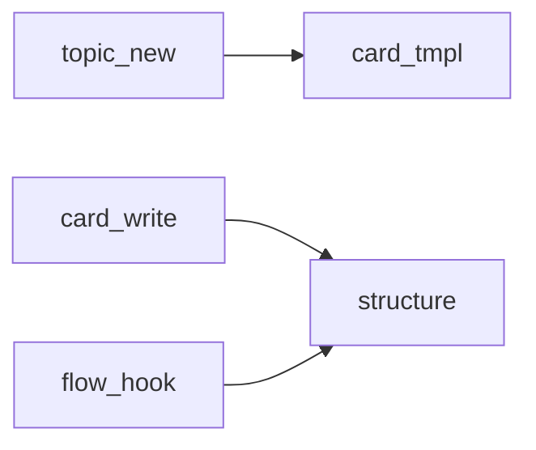

# 基础话题模板与第四组件机制

> **锚定**：SKILL.md §3.2 初始化  
> **定位**：解释基础话题卡的 TOC、`template.md`、单元模板与地图渲染边界。SKILL.md 只保留执行入口，本文件承载展开说明。

---

## 1. 四组件关系

基础话题不是另一种文件类型，仍然是话题；区别在于它们初始化时自带稳定结构和建构模板。标准话题目录以三件套为核心，基础话题默认增加第四组件：

| 文件 | 地位 | 承载 | 不承载 |
|:---|:---|:---|:---|
| `scratch.md` | 过程源 | 讨论、反馈、失败、转折、原话 | 最终规范 |
| `card.md` | 结论源 | 提炼后的结构化结论和当前共识 | 长篇模板说明 |
| `tasks.md` | 执行源 | 任务、状态、依赖、验收证据 | 完整认知链 |
| `template.md` | 建构源 | 本话题如何写、可重复单元模板、地图渲染约定 | 具体结论、任务状态 |

`template.md` 是第四组件，但不是第四个真理源。它约束 `card.md` 的写入方式，帮助 AI 判断内容应如何组织；真正的结论仍沉淀在 `card.md`。

---

## 2. TOC 与 template.md 的边界

TOC 是结构契约，负责卡片中的稳定 section。`template.md` 是建构说明，负责 section 内部内容如何规范化。

| 层级 | 管什么 | 示例 |
|:---|:---|:---|
| TOC | 稳定 section | `2 节点地图`、`3 关系地图` |
| section 说明 | section 的写入边界 | “本节记录原子模块节点，不按文件夹层级罗列” |
| unit template | 可重复对象的字段 | Trace 任务、模块节点、关系边、视觉锚点 |
| renderer | 人类如何读地图 | Markdown 表格、Mermaid、HTML dashboard |

不能把每个模块、每个视觉锚点、每个任务都塞进 TOC。TOC 保持低负担和稳定；具体实例由 `template.md` 中的单元模板进入正文。

---

## 3. Vision：稳定契约型

Vision 最适合由 TOC 控制。`template.md` 只需要提醒 Vision 不应膨胀成完整 PRD、论文计划书或研究方案全文。

### 写入边界

- 写目标对象、使用/发表/验收场景、完成样态、验收标准、边界与非目标。
- 不写执行步骤，不写完整正文，不写过程反馈。
- 细节成型后可迁入 `doc/vision.md`。

### 建构提示

```markdown
### Vision 条目

| 字段 | 内容 |
|:---|:---|
| 目标对象 | 项目要生成或完成的对象是什么 |
| 使用场景 | 谁在什么场景下使用、阅读或验收它 |
| 完成样态 | 做成后应呈现什么形态 |
| 验收证据 | 如何判断已经完成 |
| 边界 | 哪些内容暂不纳入 |
```

---

## 4. Structure：关系地图型

Structure 不是目录树。学术项目中它是论证地图，实证项目中它是证据链地图，代码项目中它是 codemap。

### 4.1 学术 Structure：论证地图

```markdown
### 论证节点：<节点名>

| 字段 | 内容 |
|:---|:---|
| 要成立的判断 | 本节点要证明什么 |
| 上游依赖 | 它依赖哪些概念、文献或材料 |
| 下游作用 | 它支撑后文哪个判断 |
| 证据配置 | 文献、案例、图表、公式 |
| 风险 | 可能被质疑的地方 |
```

### 4.2 实证 Structure：证据链地图

```markdown
### 变量：<变量名>

| 字段 | 内容 |
|:---|:---|
| 理论角色 | 被解释变量 / 核心解释变量 / 控制变量 / 机制变量 |
| 操作化方式 | 如何从数据变成变量 |
| 数据来源 | 来自哪个数据集或字段 |
| 进入模型 | 出现在哪些模型中 |
| 解释风险 | 可能的测量偏差或替代解释 |
```

```markdown
### 模型路径：<模型名>

| 字段 | 内容 |
|:---|:---|
| 目的 | 这个模型验证什么 |
| 输入 | 使用哪些样本和变量 |
| 输出 | 产生哪些结果表或图 |
| 对照关系 | 与基准、稳健性或异质性模型怎么比较 |
| 解释位置 | 结果服务哪个研究判断 |
```

### 4.3 代码 Structure：codemap

codemap 必须体现地图理念：模块是节点，调用、依赖、数据流、状态流、事件流是边。不要把 codemap 写成文件夹层级或模块清单。

```markdown
### 模块节点：<模块名>

| 字段 | 内容 |
|:---|:---|
| 原子职责 | 这个模块独立承担什么 |
| 入口 | 从哪里进入它 |
| 输出 | 它产生什么结果 |
| 依赖 | 它依赖哪些模块、配置、数据 |
| 被谁使用 | 哪些模块调用或读取它 |
| 变更影响 | 改它会牵动哪里 |
```

```markdown
### 关系边：<起点> → <终点>

| 字段 | 内容 |
|:---|:---|
| 关系类型 | 调用 / 读取 / 写入 / 订阅 / 渲染 / 配置影响 |
| 触发条件 | 什么时候发生 |
| 传递对象 | 参数、状态、事件、数据结构 |
| 风险 | 断开或改动后会影响什么 |
```

---

## 5. Style：表达/映射规范型

Style 在不同套餐中的对象不同。学术套餐管文风与语言细节，实证套餐管结果呈现，代码套餐管 UI 变量的可视层级地图。

### 5.1 学术 Style：文风与语言细节

```markdown
### 表达规则：<规则名>

| 字段 | 内容 |
|:---|:---|
| 适用范围 | 哪些章节或文本类型适用 |
| 规则 | 稳定表达方式是什么 |
| 例子 | 推荐写法或禁忌写法 |
| 例外 | 哪些场景可以偏离 |
```

### 5.2 实证 Style：结果呈现规范

```markdown
### 结果呈现规则：<规则名>

| 字段 | 内容 |
|:---|:---|
| 适用对象 | 表格 / 图形 / 模型结果 / 稳健性说明 |
| 报告口径 | 系数、显著性、标准误、样本量等如何表述 |
| 解释顺序 | 先报告什么，再解释什么 |
| 不确定性 | 不显著、反直觉或稳健性不足时如何写 |
```

### 5.3 代码 Style：UI 视觉—变量—组件映射

代码 Style 不是命名规范，也不是普通代码风格。它从用户看到的画面出发，建立视觉锚点、状态、变量、组件和实现位置之间的映射。

```markdown
### 视觉锚点：<对象名>

| 字段 | 内容 |
|:---|:---|
| 用户看到什么 | 画面中的位置、形态、层级 |
| 状态有哪些 | normal / hover / active / loading / disabled / error |
| 由什么控制 | 变量、props、class、token、配置 |
| 落在哪里 | 组件、样式文件、设计 token、渲染入口 |
| 交互手感 | 点击、过渡、反馈、延迟、动效 |
| 易错点 | 用户感受与组件树不一致的地方 |
```

---

## 6. Trace：重复任务单元型

Trace 顶层不按“所有背景 / 所有尝试 / 所有反馈”组织。Trace 以任务单元为核心，每个任务内部保留完整因果链。

```markdown
### T{n} <任务名>

| 字段 | 内容 |
|:---|:---|
| 背景 | 问题从哪里来 |
| 尝试 | 做过哪些动作 |
| 反馈 | 用户、测试或事实给了什么反馈 |
| 转折 | 方案为什么改变 |
| 验收 | 如何知道这一步完成 |
| 遗留 | 还没有解决什么 |
```

复杂任务可以新建独立 Trace 话题，基础 Trace 只保留索引和去向。

---

## 7. 地图渲染约定

地图类对象必须同时考虑机器可解析和人类可读。

### 源数据层

优先用 Markdown 表格或结构化小节记录节点、关系边、视觉锚点、变量映射。这一层便于脚本解析。

### 阅读层

正文中保留简短说明，解释地图覆盖范围、关键节点和关键风险，避免只剩表格。

### 渲染层

可由脚本从源数据层生成 Mermaid、HTML dashboard 或索引表。例如 codemap 可以渲染为：



渲染层是辅助视图，不替代 `card.md` 和 `template.md`。

---

## 8. 自动化边界

模板机制的实现顺序：

1. 先建立本说明文件，明确语义和边界。
2. 初始化基础话题时生成 `template.md` 第四组件。
3. `card_write.py` 读取 `template.md`，支持 `--unit` 实例化重复单元。
4. 校验单元字段和位置。
5. 最后检查 hooks，只做提醒和兜底。

模板用于防止漏字段、放错位置、把地图型对象写成普通清单；模板不能替代判断，也不能要求 AI 编造未知信息。未知字段应保留“（待定）”。
